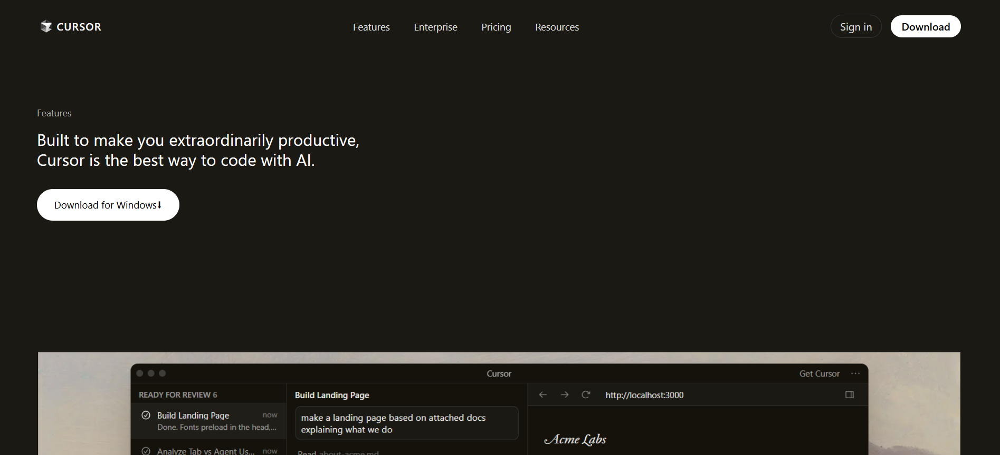
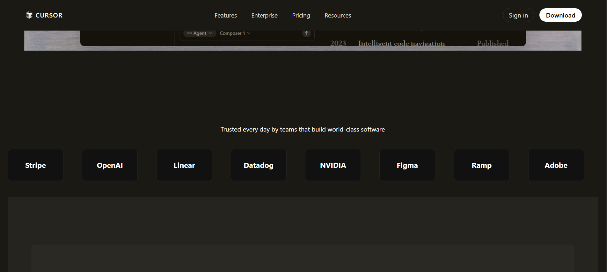
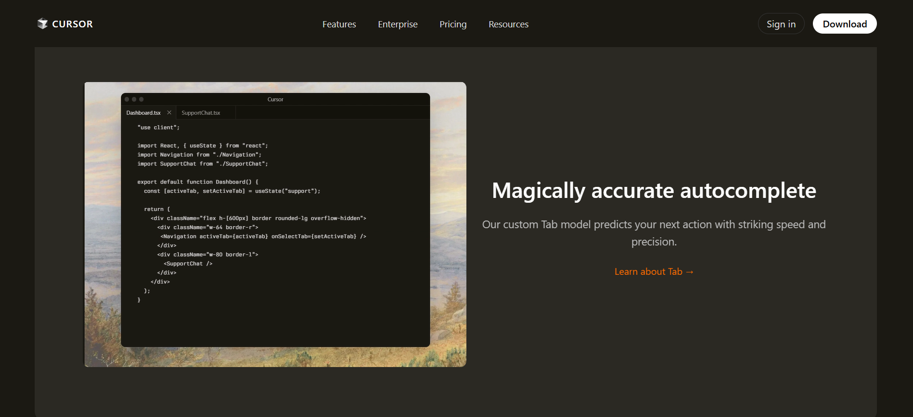
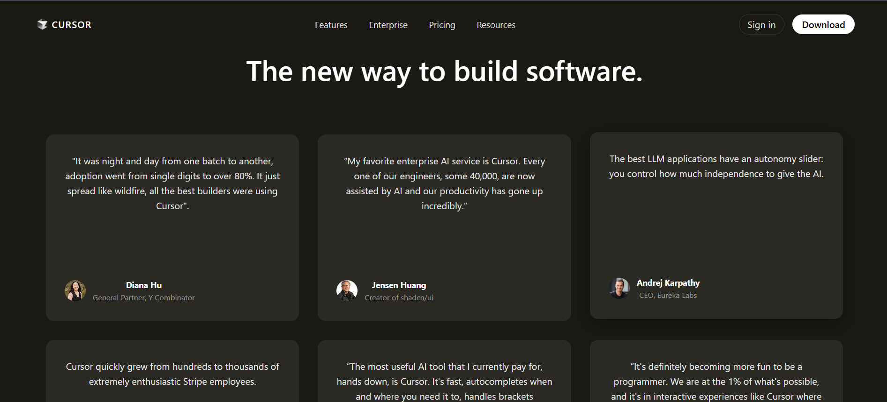
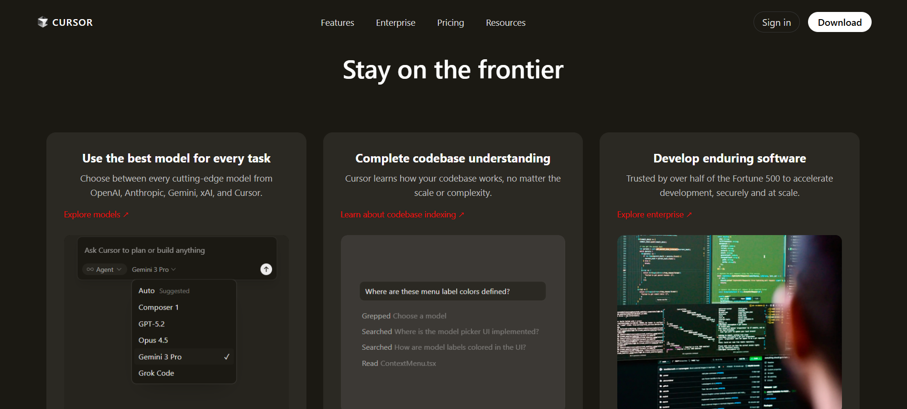
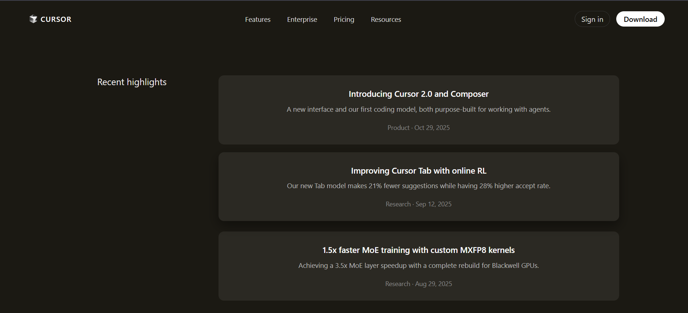
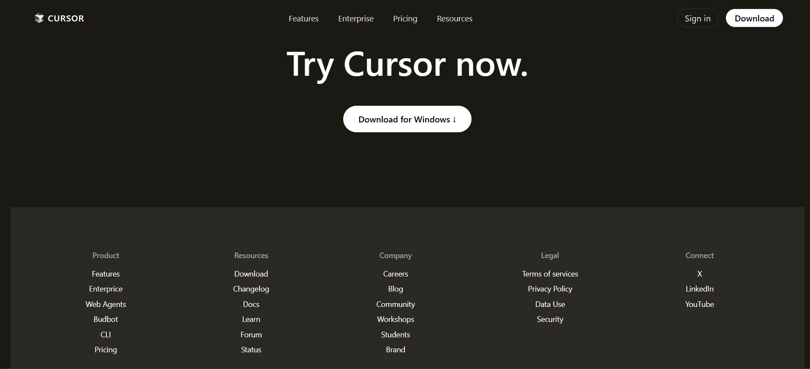

# Cursor Landing Page Clone (HTML & CSS)

This repository contains a detailed recreation of the **Cursor official landing page UI** using **pure HTML and CSS**.  
The project focuses on accurately replicating layout structure, dark-theme styling, typography, spacing, and component behavior while keeping the code clean and readable.

---

## 🔗 Live Demo (Hosted Website)

👉 Live Website (netlify):  
https://zippy-jelly-7c91f9.netlify.app/


---
## 🎥 Video Demo

📽️ **Project Walkthrough Video:** (linkedin)
https://www.linkedin.com/posts/peeyush-tiwari-a4b802319_webdevelopment-frontend-assignmentcompleted-activity-7425212365169709056

---

## 📌 Sections Recreated

The following sections have been recreated based on the reference design:

- Sticky Navigation Bar (Logo, Menu Links, CTA Buttons)
- Hero Section with CTA
- Trusted By Logos Section
- Agent Feature Sections
- Cursor Autocomplete Feature (Video Section)
- Testimonials Grid
- Frontier / Feature Cards Section
- Changelog Section
- Recent Highlights / Blog Cards
- Call To Action (Download Section)
- Complete Footer with Multi-column Links

---
## 📸 Desktop View Screenshots

Below are some desktop preview screenshots of the project:










---

## 🎨 Fonts Used

- **Primary Font:** Inter  
- **Fallback Fonts:**


font-family: 'Inter', -apple-system, BlinkMacSystemFont, 'Segoe UI', sans-serif;
## 🎯 Color Palette

| Usage | Color Code |
|------|-----------|
| Main Background | `#1b1913` |
| Secondary Background | `#2b2923` |
| Section Background | `#26241e` |
| Border Color | `#2b2923`, `rgba(255,255,255,0.04)` |
| Primary Text | `#ffffff` |
| Secondary Text | `#bdbdbd`, `#b8b8b8` |
| Muted Text | `#9e9e9e`, `#8a8a8a` |
| Accent / Link Color | `#f30a0a` |
| Highlight Link | `#ff6a00` |
| Button Background | `#ffffff` |
| Button Text | `#000000` |

🛠️ Technologies Used

1.HTML5

2.CSS3

3.Flexbox

4.CSS Grid

Video & Image Embeds
📂 Project Structure
```
├── index.html
├── style.css
├── images/
├── screenshots/
│   ├── desktop.png
│   └── section.png
└── README.md
```
🚀 How to Run Locally

1.Clone the repository:

git clone https://github.com/your-username/your-repository-name.git


2.Open index.html in any modern browser.

🚀 Future Improvements

1.Add JavaScript-based interactions

2.Improve accessibility (ARIA roles, contrast)

3.Add subtle animations for better UX

4.Mobile-first refinements


## 😊 Happy Coding

This project was built with attention to detail, clean structure, and a focus on learning modern frontend practices.  
Feel free to explore the code, experiment with the layout, and improve upon it.

Happy Coding! 🚀

👤 Author

Peeyush Tiwari
🎓 Software Engineer | Frontend Enthusiast

🔗 LinkedIn: https://www.linkedin.com/in/your-linkedin-username

🐙 GitHub: https://github.com/peeyushtiwari888


